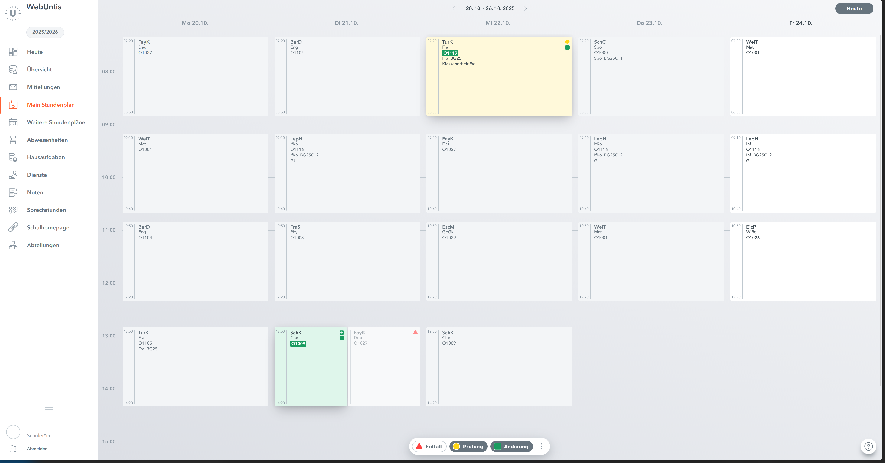
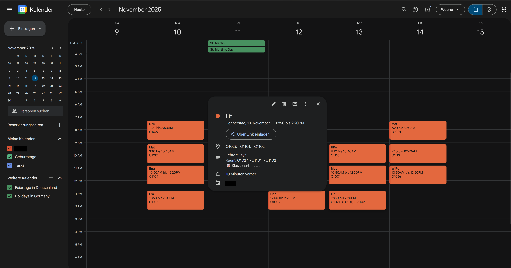
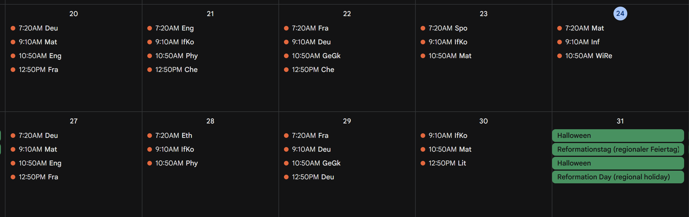
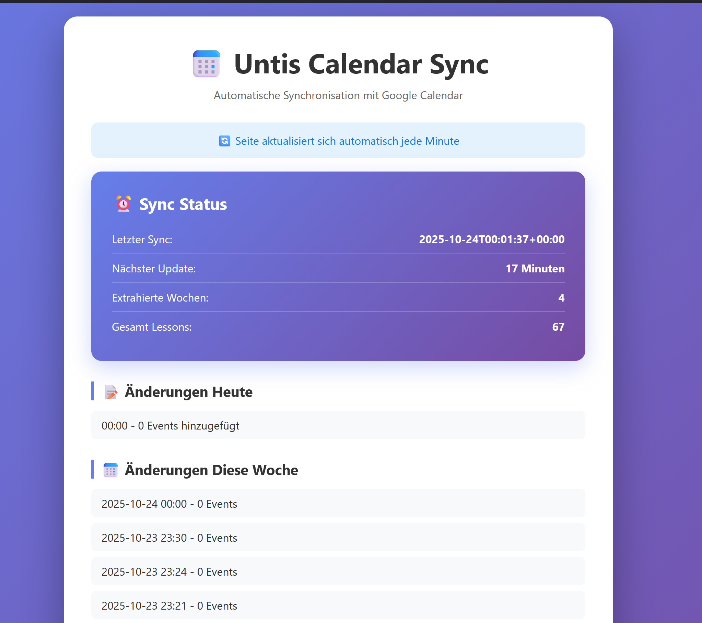
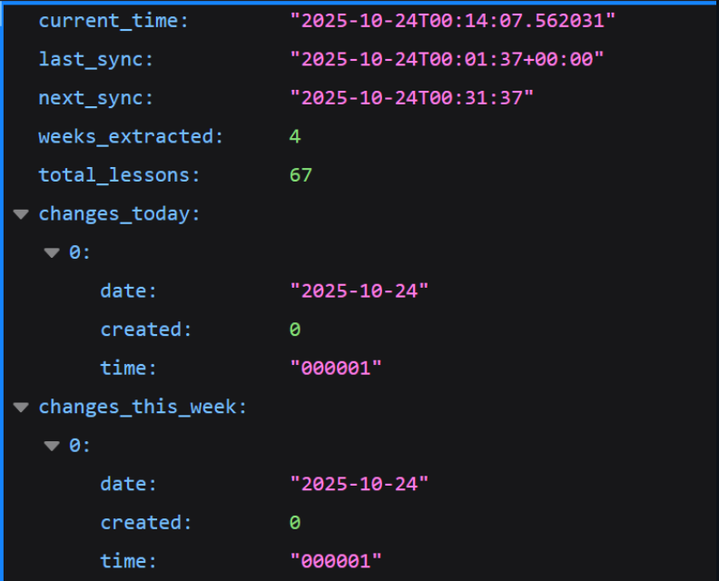

<div align="center">

# 📅 WebUntis → Google Calendar Sync

**Automated schedule synchronization that actually works**

[](https://opensource.org/licenses/MIT)
[](https://www.python.org/downloads/)
[](https://www.selenium.dev/)

*Extracts your schedule from WebUntis and syncs it to Google Calendar every 30 minutes.*

[Features](#features) • [Installation](#installation) • [Usage](#usage) • [Showcase](#showcase) • [Setup Guide](SETUP.md)

---

</div>

> **Note from the Developer**  
> *POV: Me at 2 AM building this instead of studying...  
> Also me at 6 AM writing a Chemistry exam... YES, I did this. Worth it? Absolutely.*

## Showcase

<div align="center">

### WebUntis Schedule


### Google Calendar Integration



### Monitoring

<p>
  
  
</p>

</div>

## Features

- **Automated Sync**: Updates every 30 minutes via cron
- **Duplicate Prevention**: UID-based tracking prevents duplicate entries
- **Room Change Detection**: Handles room changes and updates
- **Note Extraction**: Separates exam notes from regular room information
- **Live Dashboard**: Web interface showing sync status and history
- **Headless Operation**: Runs on servers without GUI using Selenium

## Prerequisites

- Python 3.8+
- Google Calendar API credentials
- WebUntis account
- Chrome/Chromium browser (for Selenium)

## Installation

### 1. Clone Repository

```bash
git clone https://github.com/YOUR_USERNAME/untis-calendar-sync.git
cd untis-calendar-sync
```

### 2. Install Dependencies

```bash
python3 -m venv venv
source venv/bin/activate
pip install -r requirements.txt
```

### 3. Configure Environment

Create `.env` file:

```bash
UNTIS_SCHOOL='YourSchoolName'
UNTIS_USERNAME='your.username'
UNTIS_PASSWORD='your_password'
UNTIS_WEEKS=4
UNTIS_HEADLESS=true
```

### 4. Setup Google Calendar API

1. Go to [Google Cloud Console](https://console.cloud.google.com/)
2. Create a new project
3. Enable Google Calendar API
4. Create OAuth 2.0 credentials (Desktop app)
5. Download credentials and save as `credentials.json`

### 5. First Run

```bash
./run_full_sync.sh
```

This will:
- Authenticate with Google (opens browser)
- Extract 4 weeks of schedule data
- Create calendar events

## Usage

### Manual Sync

```bash
# Full sync (extract from WebUntis + sync to Calendar)
./run_full_sync.sh

# Status check
./check_status.sh
```

### Automated Sync (Cron)

Add to crontab:

```bash
*/30 * * * * /path/to/untis-calendar-sync/auto_sync.sh >> /path/to/logs/cron.log 2>&1
```

This runs a full sync every 30 minutes, detecting changes, cancellations, and room updates.

### Status Dashboard

Start the web server:

```bash
python3 status_server.py
```

Access dashboard at `http://localhost:8080/dashboard`

Features:
- Last sync time
- Next sync countdown
- Changes today/this week
- Event statistics

## Configuration

### Color Coding

Events are color-coded in Google Calendar (default: Orange).

Change in `untis_sync_improved.py`:

```python
'colorId': '6',  # 1=Blue, 3=Purple, 6=Orange, 11=Red
```

### Number of Weeks

Adjust in `.env`:

```bash
UNTIS_WEEKS=4  # Extract 1-8 weeks ahead
```

### Sync Frequency

Edit crontab entry:

```bash
*/30 * * * *  # Every 30 minutes
*/15 * * * *  # Every 15 minutes
0 * * * *     # Every hour
```

## File Structure

```
untis-calendar-sync/
├── extractor.py              # WebUntis scraper (Selenium)
├── untis_sync_improved.py    # Parser & Calendar sync logic
├── sync_all_weeks.py         # Multi-week sync orchestrator
├── auto_sync.sh              # Main cron script
├── run_full_sync.sh          # Manual full sync script
├── status_server.py          # Web dashboard server
├── status_api.py             # CLI status tool
├── check_status.sh           # Quick status script
├── cleanup_calendar.py       # Remove all Untis events
├── remove_duplicates.py      # Find & remove duplicates
└── quick_sync.py             # Sync without extraction
```

## How It Works

### 1. Extraction (extractor.py)

- Uses Selenium WebDriver (headless Chrome)
- Logs into WebUntis
- Navigates through weeks
- Scrapes lesson data (subject, time, room, teacher)
- Saves to JSON files (`weekly_data/week_*.json`)

### 2. Parsing (untis_sync_improved.py)

- Reads JSON files
- Detects day boundaries (time resets)
- Extracts room information (handles changes with +)
- Separates notes (exams, special events)
- Generates unique IDs (MD5 hash)

### 3. Synchronization

- Loads existing Calendar events
- Compares UIDs to prevent duplicates
- Creates new events
- Skips unchanged events
- Updates `sync_status.json`

## Troubleshooting

### WebUntis Login Fails

Check credentials in `.env`:
```bash
source .env
echo $UNTIS_USERNAME
echo $UNTIS_SCHOOL
```

### No Events Created

Check parsed data:
```bash
cat parsed_lessons_all_weeks.json | python3 -m json.tool | less
```

### Duplicate Events

Remove duplicates:
```bash
python3 remove_duplicates.py
```

### Calendar Not Updating

Check logs:
```bash
tail -f logs/auto_sync_*.log
tail -f logs/cron.log
```

### Selenium Issues

Install/update Chrome:
```bash
apt update
apt install chromium-browser
```

## API Reference

### Status API

**Endpoint**: `http://localhost:8080/status`

**Response**:
```json
{
  "current_time": "2025-10-23T23:00:00",
  "last_sync": "2025-10-23T22:30:00",
  "next_sync": "2025-10-23T23:00:00",
  "weeks_extracted": 4,
  "total_lessons": 67,
  "changes_today": [...],
  "changes_this_week": [...]
}
```

## Contributing

Contributions welcome! Please:

1. Fork the repository
2. Create a feature branch
3. Make your changes
4. Test thoroughly
5. Submit a pull request

## License

MIT License - See LICENSE file for details

## Privacy

This tool:
- Stores credentials locally in `.env`
- Uses OAuth2 for Google Calendar (token.pickle)
- Does not send data to third parties
- Runs entirely on your infrastructure

Keep sensitive files secure and never commit them to version control.

## Support

- Issues: GitHub Issues
- Documentation: This README
- Status: Check `./check_status.sh`

## Changelog

### Version 1.0.0
- Initial release
- Automated 30-minute sync
- Duplicate prevention
- Room change detection
- Web dashboard
- Note extraction
